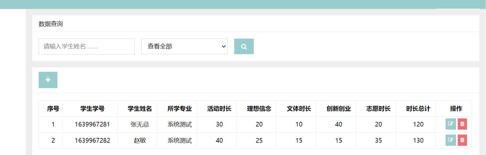

# Duration Management System

### Project Background

Due to the complexity of the school’s duration system and the excessive number of categories, many students often lack a clear understanding of personal duration records. Activities are frequently completed without accurate tracking, and the variety of categories can lead to insufficient duration requirements being discovered in the following academic year. In response to these issues, a duration management system was created to assist in organizing and maintaining related information.

### Project Introduction

Integrating Spring and MyBatis can involve extensive configurations. To streamline development, Spring Boot and MyBatis-Plus are utilized to automate essential settings with minimal manual work. The `src` directory contains Java code, `libs` stores third-party framework packages, and `out` holds generated files needed for runtime. Under `src`, the `static` folder includes front-end elements such as CSS for styling and JavaScript (`js`) for sending requests to the back-end. When a menu item is clicked, the system locates the corresponding HTML file within `pages`. The `templates` directory holds shared components such as the navigation bar, footer, and header definitions. A `login.html` file is placed at the outer level of `static` to serve as the login page, enabling modifications to be made within the `static` folder.


Below is an illustration of the `pages` directory, where each left-side menu option corresponds to a specific HTML page.


`templates` contains common parts for pages, including the left-side menu, top navigation bar, and a footer. A single file, such as `head.html`, references key styles and scripts for all pages, allowing consistent updates through a central location. When logging in, the user interface is primarily managed by `login.html`, and its functionality is supported by `login.js` within the `js` folder.


Below is a snippet of code from `login.html`:

```html
<div class="login-container">
    <div class="login-body">
        <div class="login-title">
            登录
        </div>
        <div class="login-form">
            <form name="loginForm" action="" class="fater-form">
                <div class="fater-form-block">
                    <input type="text" name="userName" placeholder="请输入登录账号"/>
                </div>
                <div class="fater-form-block">
                    <input type="password" name="passWord" placeholder="请输入登录密码"/>
                </div>
                <div class="fater-form-block">
                    <button type="button" id="loginFormBtn" class="fater-btn fater-btn-primary fater-btn-block">
                        登录
                    </button>
                </div>
            </form>
        </div>
    </div>
</div>
```

The above section renders the login form. login.js then handles form validation, including checks for empty fields and sending Ajax requests ($.ajax) to the controller. Successful authentication stores user details in the session, while errors prompt messages indicating invalid credentials.

The Java portion of the code runs through the Run method in the Application class, with application.yml providing essential project configurations such as port number (9999), project root path, and additional modules. The most crucial part is the datasource section, which specifies the database username, password, connection URL, driver (e.g., com.mysql.cj.jdbc.Driver), and connection pool type (e.g., com.alibaba.druid.pool.DruidDataSource). An XML file controls output details for login credentials, queries, and pagination, assisting with standardized log formatting.

```java
datasource:
    username: root
    password: liyuming
    url: jdbc:mysql://localhost:3306/study_durations?zeroDateTimeBehavior=convertToNull&serverTimezone=Asia/Shanghai&useUnicode=true&characterEncoding=utf8
    driver-class-name: com.mysql.cj.jdbc.Driver
    type: com.alibaba.druid.pool.DruidDataSource
    initialSize: 5
    minIdle: 5
    maxWait: 60000
```

Inside the project’s Java package, there are three smaller packages following the MVC pattern. The entity package handles database mapping, while the DAO layer accesses and modifies data. For instance, StudentsDao extends MyBatis-Plus’s BaseMapper, which automatically provides methods for data insertion, updates, and deletions. Query results are mapped to entities based on column and property names. Annotation-based SQL statements, such as the one below, enable further control and customization:

```java
public interface StudentsDao extends BaseMapper<Students> {

    @Select("<script>" +
            "SELECT " +
            "u.id, u.user_name userName, u.pass_word passWord, " +
            "u.name, u.gender, u.age, u.type, " +
            "s.grade, s.major_id majorId,  " +
            "(SELECT name FROM majors WHERE id = s.major_id) majorName " +
            "FROM users u, students s " +
            "<where>" +
            "u.id = s.id " +
            "<if test='userName != null and userName.trim() != &quot;&quot; '>" +
            "AND u.user_name LIKE CONCAT('%', #{userName}, '%') " +
            "</if>" +
            "<if test='name != null and name.trim() != &quot;&quot; '>" +
            "AND u.name LIKE CONCAT('%', #{name}, '%') " +
            "</if>" +
            "<if test='majorId != null and majorId.trim() != &quot;&quot; '>" +
            "AND s.major_id = #{majorId} " +
            "</if>" +
            "</where>" +
            "</script>")
    public Page<Map<String, Object>> qryPageInfos(Page<Map<String, Object>> page,
                                                  @Param("userName") String userName,
                                                  @Param("name")String name,
                                                  @Param("majorId")String majorId);
}
```

In addition, a service layer is placed between the M layer and the C layer to handle logic that involves multiple tables or intricate operations, such as verifying dependent records before deleting an entry. This approach keeps the DAO and controller layers simpler and more organized.

Below is an example of a controller class (StudentsController) that receives requests, triggers service-layer methods, and returns results to the front-end interface:

```java
public class StudentsController extends BaseController {

    protected static final Logger Log = LoggerFactory.getLogger(StudentsController.class);

    @Autowired
    private StudentsService studentsService;

    @Autowired
    private MajorsService majorsService;

    @RequestMapping("")
    public String index(Map<String, Object> map) {

        List<Majors> list = majorsService.getAll();

        map.put("majors", list);

        return "pages/Students";
    }

    @GetMapping("/info")
    @ResponseBody
    public R getInfo(String id) {

        Log.info("查找指定学生信息，ID：{}", id);

        Students students = studentsService.getOne(id);

        return R.successData(students);
    }

    @GetMapping("/page")
    @ResponseBody
    public R getPageInfos(Long pageIndex, Long pageSize,
                          String userName, String name, String majorId) {

        Log.info("分页查找学生信息，当前页码：{}，"
                        + "每页数据量：{}, 模糊查询，学生账号：{}，学生姓名：{}，学生专业：{}", pageIndex,
                pageSize, userName, name, majorId);

        PageData page = studentsService.getPageInfo(pageIndex, pageSize, userName, name, majorId);

        return R.successData(page);
    }

    @PostMapping("/add")
    @ResponseBody
    public R addInfo(Users user, Students students) {

        String id = IDUtils.makeIDByCurrent();

        students.setId(id);
        user.setId(id);

        Log.info("添加学生信息，传入参数：{}", students);

        studentsService.addStudent(user, students);

        return R.success();
    }

    @PostMapping("/upd")
    @ResponseBody
    public R updInfo(Students students) {

        Log.info("修改学生信息，传入参数：{}", students);

        studentsService.update(students);

        return R.success();
    }

    @PostMapping("/del")
    @ResponseBody
    public R delInfo(String id) {

        Log.info("删除学生信息, ID:{}", id);

        Students students = studentsService.getOne(id);

        studentsService.delete(students);

        return R.success();
    }
}
```

The controller layer is responsible for receiving front-end requests, invoking service-layer methods, and returning processed data. For example, clicking “View User Information” on the webpage sends a request to the UserController, which performs a paginated search through usersService.getPageInfo and returns data to the interface.

#### Main Interface


The Duration Management System interface provides the following options:

**1. Major Information Management**


**2. System User Management**


**3. Student Information Management**


**4. Duration Record Management**



#### Details are illustrated using the Major Information Management module as an example, due to similarity in functionality across other modules.

**Data Query**


**Data Deletion**


**Data Modification**


### Alpha Release Notes

1、Features

| Module         | Description               |
| ---------------- | -------------------------- |
| User Login Module     | Enables user login functionality           |
| Major Information Module | Manages information related to majors         |
| System User Module     | Manages system user information           |
| Student Information Module | Manages student information records      |
| Duration Record Module | Manages school duration records |

2.Operation and Usage:

Local back-end functionality requires importing relevant JAR packages. A web interface acts as the primary user interaction point, requiring only Internet access for general use. Database operations handle maintenance, relying on SQL statements for create, read, update, and delete (CRUD) functions. A graphical user interface enhances the overall user experience.

3.Limitations and Shortcomings

Certain user interface elements are not fully optimized, and quantitative data is limited. Messages are primarily text-based, potentially affecting user experience. Some functionalities remain incomplete due to technical constraints, resulting in issues such as encoding conflicts (causing garbled text on certain pages) and occasional search failures related to uninitialized databases or misconfigured connections. Ongoing improvements aim to resolve these shortcomings.

4.Project Challenges

The scope is restricted to basic login and CRUD functionality for student data, given limited time and development resources. Significant effort was devoted to learning Spring Boot and MyBatis-Plus, leading to successful implementation of core features, though the project still lacks advanced maturity.


